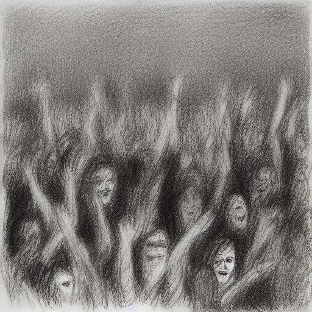

## Images Generated by Stable Diffusion model with ComfyUI

### **1. A Scenery with Water (Cartoonish 3D)**  

**Positive Prompt:**   
"A vibrant cartoonish 3D landscape featuring a serene lake surrounded by lush green hills, colorful flowers, and a bright blue sky. A small wooden pier extends into the water, with cute animated ducks swimming. The scene has a warm sunset glow, with soft lighting and smooth, Pixar-style shading."  

**Negative Prompt:**  
"Realistic details, hyperrealism, photorealism, muted colors, blurry textures, dull lighting, low contrast, distorted proportions, messy composition."  

---

### **2. A Sketch of a Music Concert**

**Positive Prompt:**  
"A highly detailed pencil sketch of a lively music concert, capturing the energy of a rock band on stage. The lead singer passionately sings into the microphone, while the guitarist plays a powerful solo. A cheering crowd with raised hands fills the background, adding depth to the dynamic scene. The shading is expressive, with strong contrast and well-defined strokes."  

**Negative Prompt:**  
"Digital painting, full color, 3D elements, blurry details, pixelation, smooth gradients, abstract distortions, unrealistic anatomy, lack of crowd interaction."  

---

### **3. A Wooden Elephant**

**Positive Prompt:**  
"A beautifully handcrafted wooden elephant sculpture, intricately carved with detailed tribal patterns and polished to a smooth finish. The rich brown wood grain is visible, giving it a natural and elegant look. The elephant stands proudly with its trunk raised, reflecting traditional craftsmanship."  

**Negative Prompt:**  
"Plastic material, metallic surfaces, poorly detailed carving, cartoonish style, artificial textures, blurry features, low-resolution patterns, unrealistic lighting."  

---

### **4. A Binocular Zoomed In and Showing Reflection of a Nuclear Scene**

**Positive Prompt:**  
"A dramatic close-up view of a pair of binoculars, sharply focused on the reflective lenses. Inside the reflection, a haunting nuclear explosion is captured—fiery mushroom clouds rising in the distance with thick, dark smoke billowing. The edges of the binoculars are sleek and detailed, giving a sense of urgency and depth."  

**Negative Prompt:**  
"Blurry reflection, unrealistic colors, poor contrast, abstract or distorted details, overexposed lighting, lack of depth, cartoonish effects, missing explosion elements."  

---

### **5. Humans Gathered for a Sports Game of Marathon**

**Positive Prompt:**  
"A dynamic and energetic scene of a marathon event, with a diverse group of runners in colorful athletic gear sprinting down a city street. Spectators cheer from the sidelines, waving banners and clapping. The morning sunlight casts long shadows, while motion blur adds a sense of speed and action. The atmosphere is lively and filled with excitement."  

**Negative Prompt:**  
"Empty streets, lack of movement, muted colors, unnatural poses, awkward proportions, blurry faces, low-energy expressions, unrealistic crowd density, dull background."  

---

### **6. A view from a Balcony from a Building**

**Positive Prompt:**  
"A balcony view from the a building, mountains visible clearly, birds flying by, a lake below right side on mountain, time around sunrise, small other buildings visible, everything looks tiny, air balloon, dystopian."

**Negative Prompt:**  
"Blur, unrealistic, still scene, cartoonish, poor contrast, poorly detailed, unrealistic anatomy, dull background, dark."
